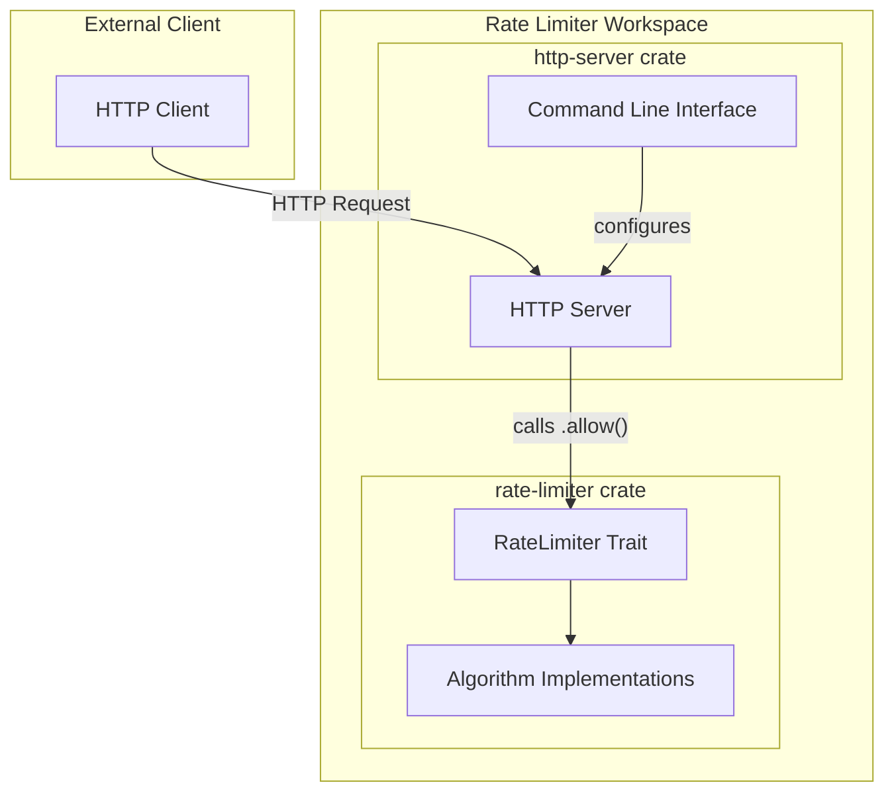

# Project Overview: Rate Limiter

The Rate Limiter project is a high-performance, lock-free implementation of various rate-limiting algorithms in Rust. It is designed to be both a reusable library and a standalone HTTP server.

## Project Structure

The repository is organized as a Cargo workspace containing two main crates:

*   **`rate-limiter`**: A core library providing the `RateLimiter` trait and several concrete implementations of popular rate-limiting algorithms. It uses atomic operations to ensure thread-safety and high performance without heavy locking.
*   **`http-server`**: An HTTP server that provides a CLI interface to run the server with different rate-limiting strategies selected via subcommands.

## Core Objectives

*   **High Performance**: Leveraging Rust's zero-cost abstractions and atomic operations for minimal overhead.
*   **Thread Safety**: All rate limiter implementations are `Send + Sync` and safe for use in highly concurrent environments.
*   **Extensibility**: The `RateLimiter` trait allows for easy addition of new algorithms.

## System Architecture

